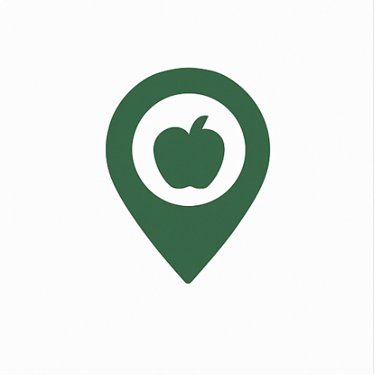

# Food Access in Washington State 

Our project is an interactive tool that helps people get a better idea on what food access in our state looks like. Food deserts are an important concept to understand equality issues, but one that isn't yet widely known, especially by the people who might be affected by it. In Washington, food deserts are concentrated in low-income urban and rural areas, such as parts of South Seattle, Yakima, and Spokane. They are areas where residents have limited access to affordable, nutritious food, which has a direct negative impact on their health and quality of life. These disparities are often linked to transportation barriers, systemic inequities, and a lack of nearby grocery stores or fresh-produce markets. Our target audience is Washington residents that don't know much about this concept or people that are curious about what patterns within this theme exist close to them. 

This website has two maps that come together to illustrate the supply limitations (distance to grocery stores) and an example of a solution to this barrier (SNAP benefits). Users are able to look up an address or selected point's distance to the nearest grocery store on the first map, and then use their finds to analyze the number households enrolled on SNAP benefits in each county. Hopefully, this will raise awareness that this lack of access isn't a coincidence – there are spatial motifs that can be addressed. 

The SNAP benefits map is a choropleth map that visualizes the household participation in the Supplemental Nutrition Assistance Program (SNAP) using county level data from the U.S Census Bureau. Each county is shaded based on the number of households receiving SNAP benefits. When hovering over a county, users are able to see the exact number of households enrolled in SNAP for that area. Clicking on a specific county reveals additional stats by showing food access data including the percentage of the county's population living more than 0.5 miles, 1 mile, 10 miles, and 20 miles of a food source, helping users understand how SNAP participation and food accessibility intersect. 

The food facility finder map shows points of all of the food facilities in King County including grocery stores, restaurants, school cafeterias, etc. When users click on a point a pop-up shows up with the name and address of that food facility. It also allows users to search any address and see the nearest food facility from the King County dataset to that location.

Our data was retrieved from:

Department of Agriculture's Food Access Research Atlas (https://catalog.data.gov/dataset/food-access-research-atlas) 
Washington's State's 2025 Census (https://catalog.data.gov/dataset/waofm-april-1-population-by-state-county-and-city-1990-to-present)
United State's Census Bureau (https://data.census.gov/table/ACSST5Y2023.S2201?q=S2201:+Food+Stamps/Supplemental+Nutrition+Assistance+Program+(SNAP)&g=040XX00US53$0500000)
King County GIS Data Catalog (https://www5.kingcounty.gov/SDC/?Layer=food_facilities_point)

Application URL: https://milaboj.github.io/FoodAccessibilityWebMap/index.html

AI disclosure: The favicon was generated by ChatGPT with requested edits. 
ChatGPT has been used in the creation of this web map to generate and debug code for the facility finder map. 
Initially, we used ChatGPT to generate a starting template for the website and used it to debug our code. When we encountered formatting issues we would copy codes into the chats to ask AI on tips to fix it. For example, when we added the image in the overview page, it was oversized and only showed a corner of it. I asked ChatGPT what I could do to fix it and it gave me directions for it.
To refine our website's visuals, We also used ChatGPT for help with finding examples on how to style the CSS of our website. The first iteration ChatGPT provided was plain and simple, so we edited the CSS to make it more eyecatching. We asked ChatGPT if it would be better to use bright or dark colors, and for tips on what type of colours to use. When there were issues with the CSS code, we also used ChatGPT for debugging. 

Applied libraries (e.g., mapbox gl js) and Web Services (e.g., github, basemap) in use: Mapbox, GitHub Pages.

